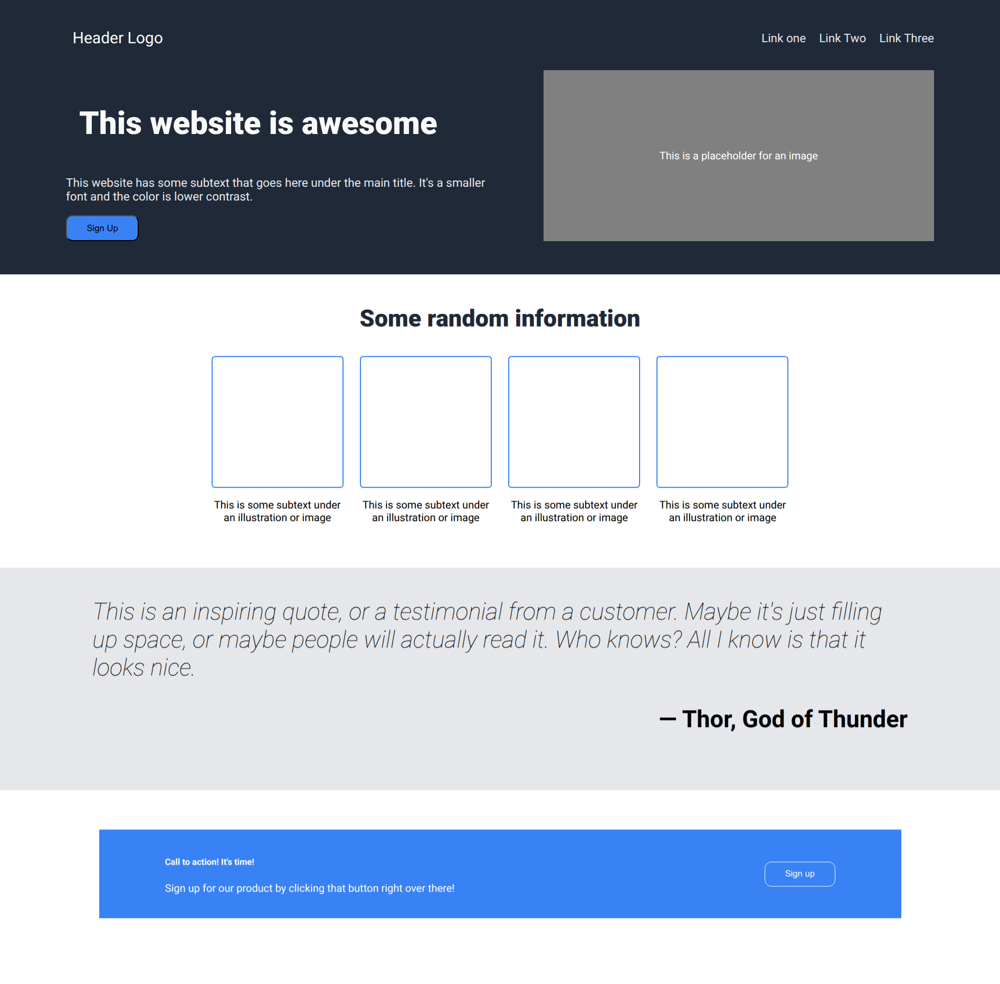

# awesome-landing-page
This project is a solution to a landing page assignment from [The Odin Project](https://www.theodinproject.com/). It focuses on building a well-structured webpage using modern HTML and CSS (Flexbox) layout techniques.

## Overview

The goal of this project was to recreate a landing page layout with an emphasis on clean structure, proper alignment, and effective use of CSS flexbox for positioning elements.

## Live Demo

🔗 [View Live Site]
(https://meltingwax-19.github.io/awesome-landing-page/)

## Screenshot

## What I Learned

Working on this project helped strengthen my understanding of:

- **Flexbox Layouts**
  Using Flexbox to effectively position and align elements across the page to achieve the desired layout.

- **Project Setup & Version Control**
  Initializing a GitHub repository at the start of the project and cloning it locally to maintain a structured workflow.

- **Atomic Commits**
  Making small, focused commits throughout the development process instead of committing everything at once. This improves version tracking and rollback safety.

## Tech Stack

- HTML5
- CSS3 (Flexbox)

## Key Takeaways

This project reinforced the importance of structuring a layout correctly, writing clean and maintainable code, and following best practices for version control from the very beginning of a project.